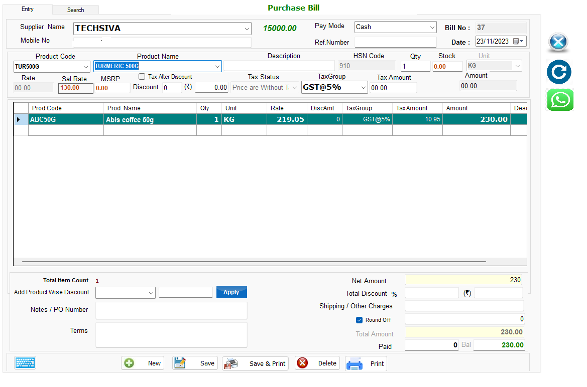
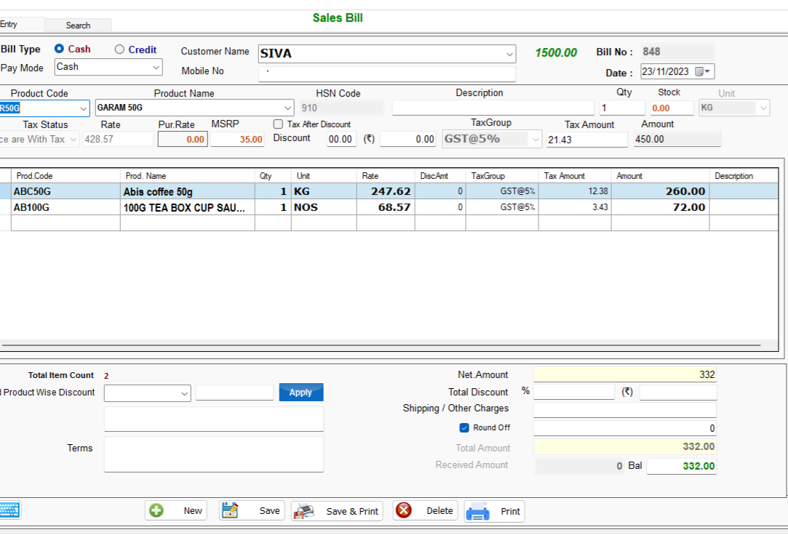
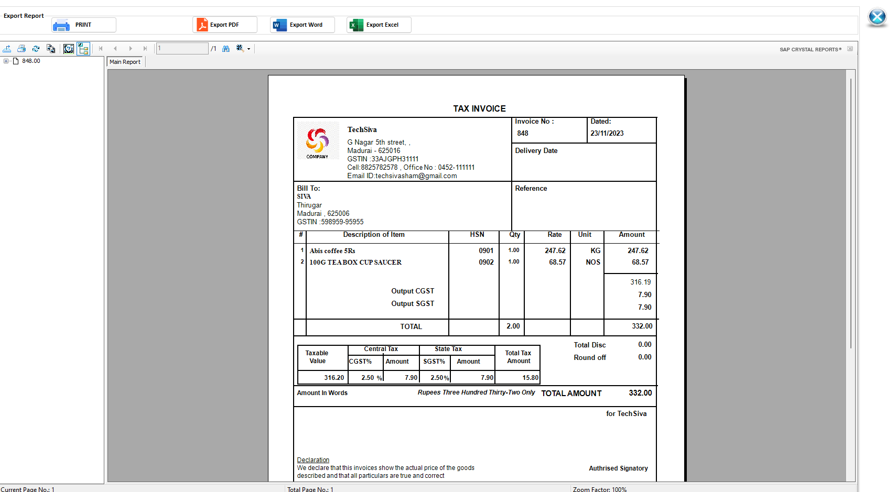

# Enterprise Management System 🏢📊

A comprehensive enterprise application developed using **VB.NET** and **SQL Server**, designed to manage core business operations including **Finance & Accounting, Human Resource Management (HRM), Manufacturing, and Inventory Management**.

This system centralizes business processes, improves operational efficiency, and provides real-time insights across departments.

---

## ✨ Key Modules

### 💰 Finance & Accounting
- Ledger Management  
- Accounts Payable & Receivable  
- Expense Tracking  
- Financial Reports (Profit & Loss, Balance Sheet)  

### 👨‍💼 Human Resource Management (HRM)
- Employee Master Management  
- Attendance & Leave Tracking  
- Payroll Processing  
- Employee Performance Tracking  

### 🏭 Manufacturing / Production
- Production Planning  
- Work Order Management  
- Bill of Materials (BOM)  
- Production Tracking  

### 📦 Inventory Management
- Stock Management  
- Purchase & Sales Tracking  
- Supplier & Vendor Management  
- Low Stock Alerts  

---

## 🛠️ Tech Stack

### Application
- VB.NET (Windows Forms)

### Database
- SQL Server

### Tools
- Visual Studio  
- SQL Server Management Studio (SSMS)  

---

## 📸 Screenshots

| Demo ScreenShots |
|:--------:|:-----------------:|
|  |
|:--------:|:-----------------:|
|  |
|:--------:|:-----------------:|
|  |


## 📁 System Architecture

```
User Interface (VB.NET Forms)
    ↓
Business Logic Layer (VB.NET Code)
    ↓
Data Access Layer (SQL Queries)
    ↓
Database (SQL Server)
```

---

## 🚀 Highlights

* Developed a **comprehensive enterprise system** using VB.NET
* Implemented **multiple business modules** (Finance, HR, Manufacturing, Inventory)
* Designed **robust database architecture** with SQL Server
* Created **user-friendly interface** for complex business operations

---

## 🔒 Confidentiality Notice

* The source code for this project is private.

* However, I am happy to discuss the following aspects in detail:

* Database Schema Design & Normalization

* Business Logic Implementation in VB.NET

* Windows Forms Application Architecture

---

## 👤 About the Developer

**Siva**   |   **Senior Software Developer**

React.js • Next.js • Node.js • Express.js • MySQL • SQL Server • VB.NET • C#
Tailwind CSS • Bootstrap • REST API Integration • Web Scraping

Expertise in building scalable CRM systems, eCommerce analytics platforms, and inventory management software. Focused on clean, maintainable code and real-world problem solving.

🔗 GitHub: https://github.com/techsivasham

---

## 📌 Project Status

✅ Completed and actively maintained for continuous improvement
