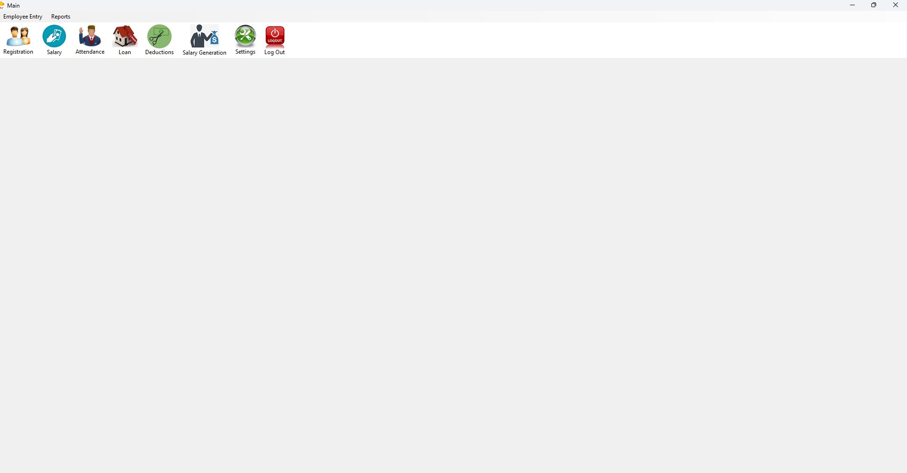
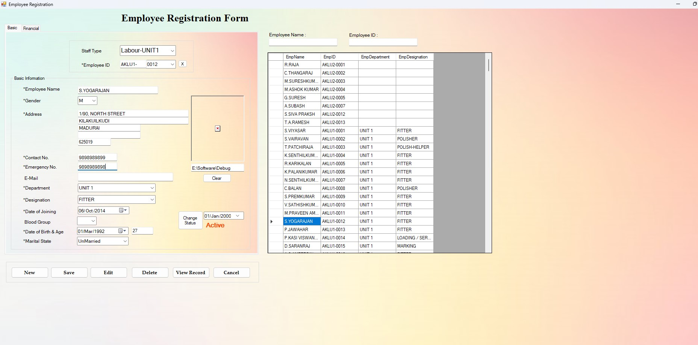
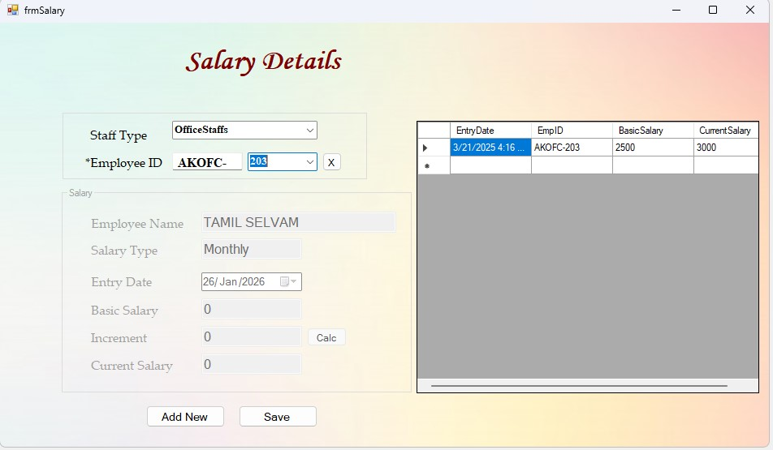
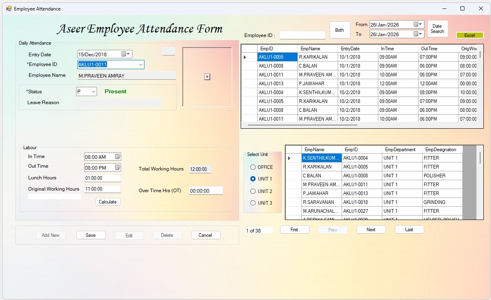
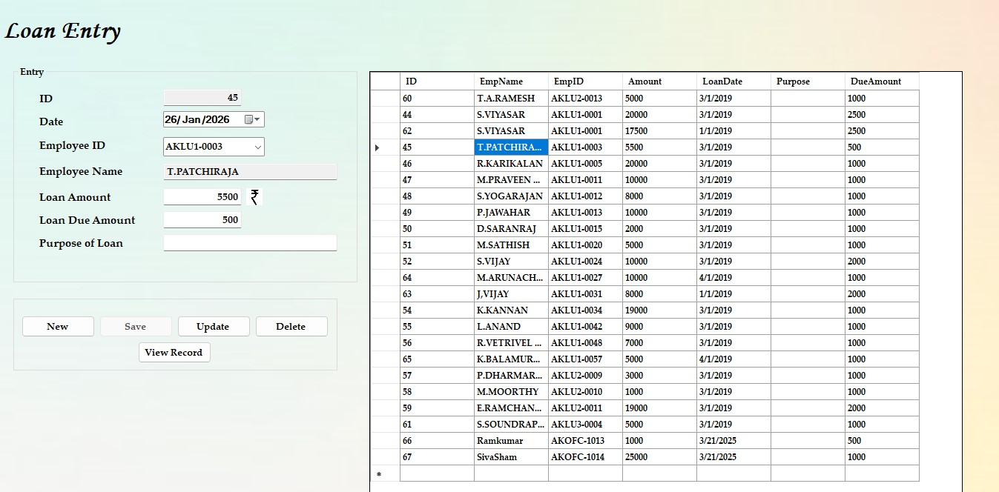
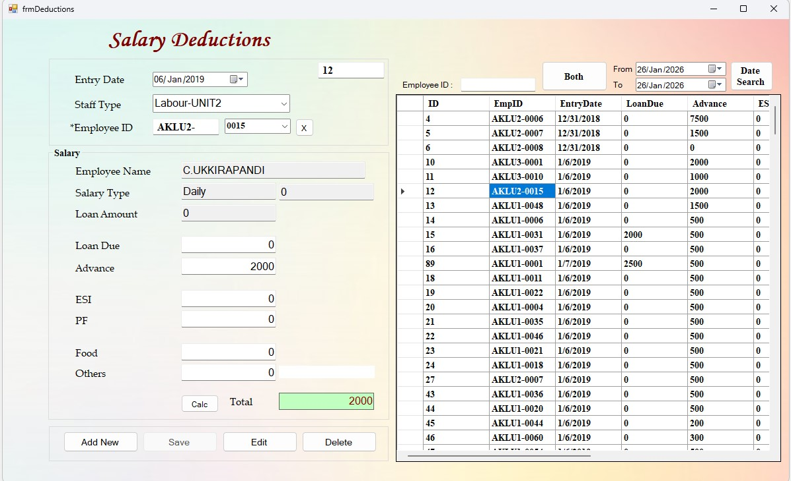
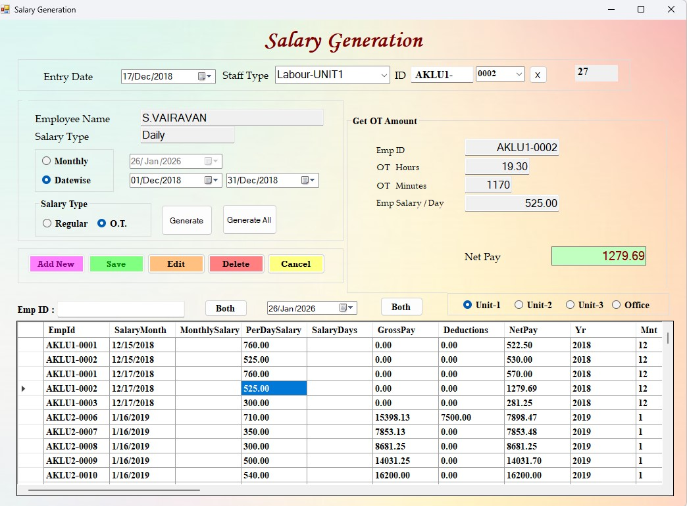
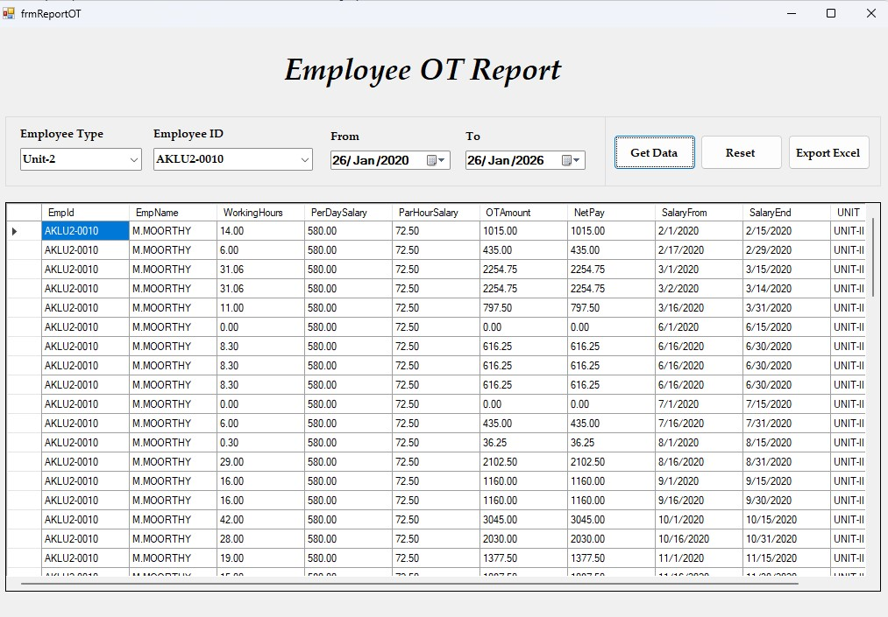
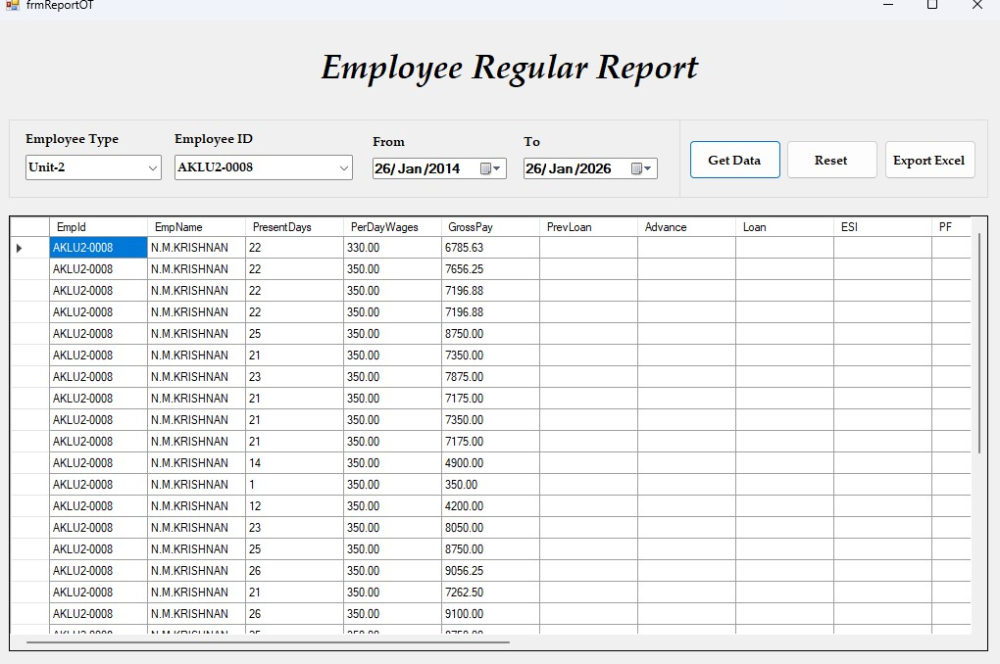

# 👥 HRMS (Human Resource Management System)

A Windows-based Human Resource Management System designed to manage employee data, attendance, salary processing, and reporting. This system streamlines HR operations with automation, accuracy, and centralized data management.

---

## 🔧 Tech Stack

**Frontend:** VB.NET (Windows Forms)
**Backend:** .NET Framework
**Database:** SQL Server

---

## ✨ Key Features

* 👤 Employee Registration & Management
* 📅 Attendance Tracking System
* 💰 Salary & Payroll Management
* 🧮 Overtime (OT) Calculation
* 💸 Loan & Deduction Management
* 📊 Reports & Analytics
* 🔐 Secure Login & User Access

---

## 📸 Screenshots

| Main Form | Employee Registration |
|:---------:|:--------------------:|
|  |  |

| Salary Details | Attendance Form |
|:--------------:|:---------------:|
|  |  |

| Loan Entry | Salary Deduction |
|:----------:|:----------------:|
|  |  |

| Salary Generation | OT Report |
|:-----------------:|:---------:|
|  |  |

| Employee Regular Report |
|:-----------------------:|
|  |

---

## 🧩 Core Modules

### 👤 Employee Management

* Employee registration and profile management
* Department and designation tracking

---

### 📅 Attendance Management

* Daily attendance entry
* In-time / Out-time tracking
* Working hours calculation
* Leave and status management

---

### 💰 Payroll System

* Salary calculation based on attendance
* Overtime (OT) calculation
* Loan and deduction handling
* Net salary computation

---

### 📊 Reports Module

* Employee attendance reports
* Salary reports
* Overtime reports
* Export to Excel functionality

---

### ⚙️ Admin & Settings

* User authentication
* Role-based access (if implemented)
* System configuration

---

## 🔄 Application Flow

User → Windows Forms UI → Business Logic → SQL Server → Processing → UI Update

---

## ⚙️ Database Design (Overview)

* `employees` → Employee details
* `attendance` → Daily attendance records
* `salary` → Payroll calculations
* `loans` → Loan management
* `deductions` → Salary deductions

---

## 📊 Business Logic Highlights

* Automatic working hours calculation
* Overtime calculation based on extra hours
* Salary computation integrating attendance, OT, and deductions
* Centralized employee data management

---

## 🧠 Challenges Solved

* Designing payroll calculation logic
* Handling attendance and overtime accuracy
* Managing relational data across HR modules
* Generating structured reports from large datasets

---

## 🚀 Highlights

* Built a complete **HR management system**
* Implemented **attendance + payroll integration**
* Designed structured **SQL Server database**
* Developed efficient **reporting system**

---

## 🔒 Confidentiality Notice

* The source code for this project is private.

* However, I am happy to discuss the following aspects in detail:

* Database Schema Design & Normalization

* Payroll and Attendance Calculation Logic

---

## 👤 About the Developer

**Siva**   |   **Full Stack Developer**

React.js • Next.js • Node.js • Express.js • MySQL • SQL Server • VB.NET • C#
Tailwind CSS • Bootstrap • REST API Integration • Web Scraping

Expertise in building scalable CRM systems, eCommerce analytics platforms, and inventory management software. Focused on clean, maintainable code and real-world problem solving.

🔗 GitHub: https://github.com/techsivasham

---

## 📌 Project Status

✅ Completed and actively maintained for continuous improvement
