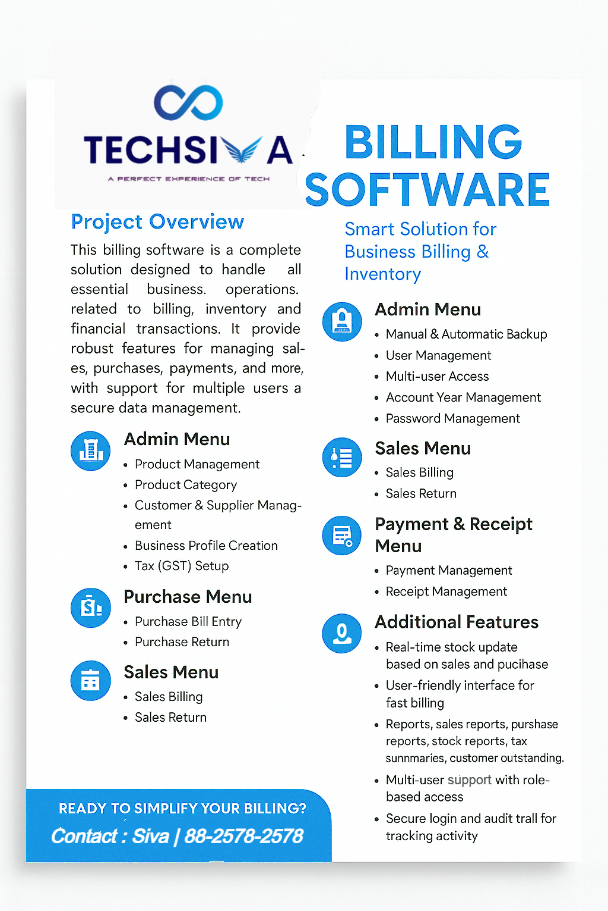
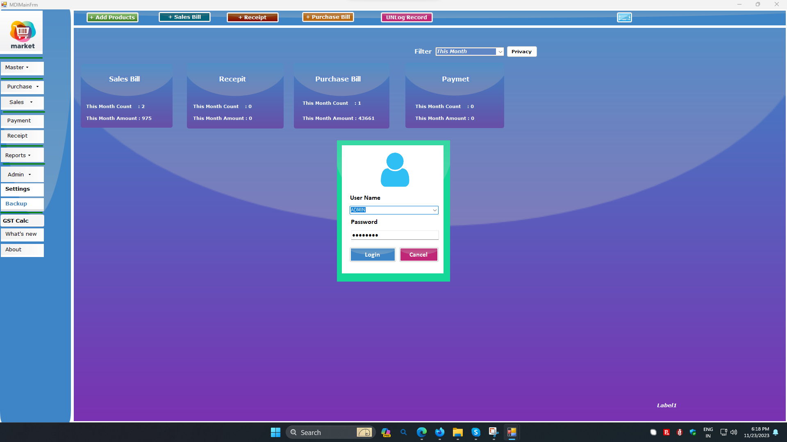
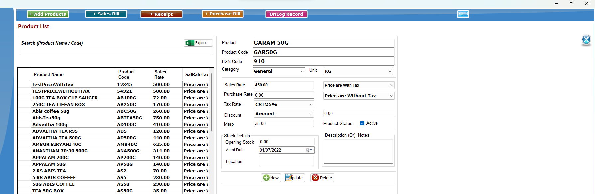
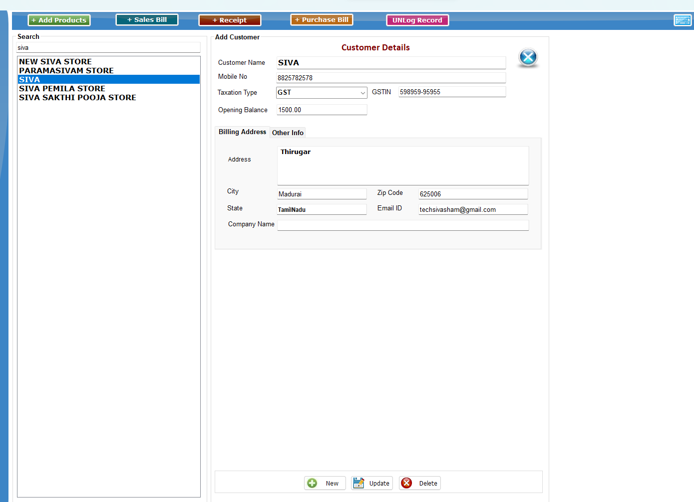
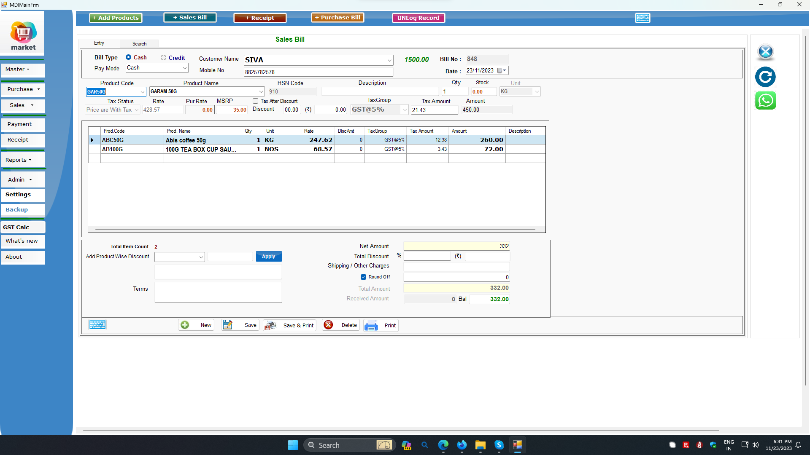
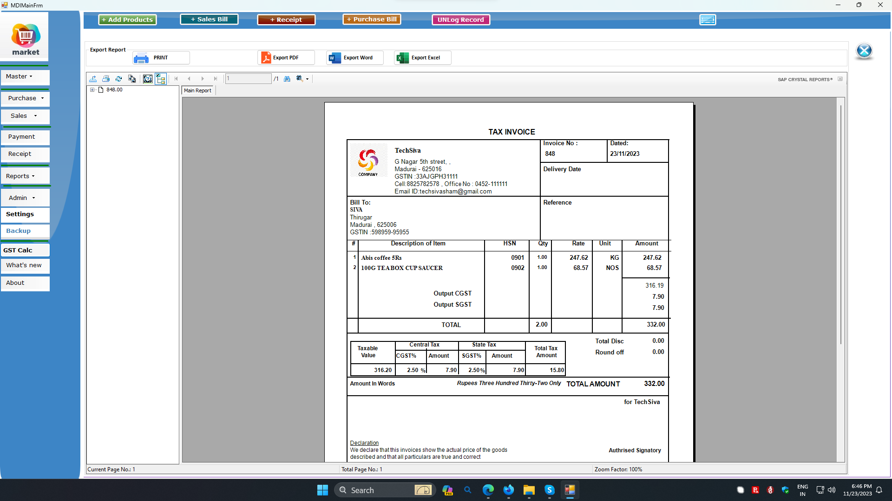

# 🧾 Billing Software (GST Enabled Billing & Inventory System)

A Windows-based billing and inventory management system built using VB.NET, designed to handle complete business operations including sales, purchases, stock management, GST calculation, and financial transactions.

---

## 🔧 Tech Stack

* **Frontend:** VB.NET (Windows Forms)
* **Backend:** .NET Framework
* **Database:** SQL Server
* **Architecture:** Desktop Application (MDI-based)

---

## ✨ Key Features

* 🧾 Sales Billing & Invoice Generation
* 📦 Inventory / Stock Management
* 🛒 Purchase Management
* 💰 Payment & Receipt Tracking
* 🧮 GST Calculation & Tax Setup
* 👥 Multi-user Access with Roles
* 🔐 Secure Login System
* 📊 Reports & Analytics
* 💾 Manual & Automatic Backup

---

## 📸 Screenshots

| Brochure | Login & Home Page |
|:--------:|:-----------------:|
|  |  |

| Product Page | Customer Details |
|:------------:|:----------------:|
|  |  |

| Sales Bill | Bill Report |
|:----------:|:-----------:|
|  |  |

## 🧩 Core Modules

### 📁 Master Management

* Product Management
* Product Category
* Customer Management
* Supplier Management
* Business Profile Setup
* GST Configuration

---

### 🛒 Sales Module

* Sales Bill Entry
* Sales Return
* Invoice generation

---

### 📦 Purchase Module

* Purchase Bill Entry
* Purchase Return

---

### 💰 Payment & Receipt

* Payment Management
* Receipt Entry
* Outstanding tracking

---

### 📊 Reports Module

* Sales Reports
* Purchase Reports
* Stock Reports
* Tax Summary Reports
* Customer Outstanding Reports

---

### ⚙️ Admin Module

* User Management
* Role-based Access Control
* Password Management
* Account Year Management
* Backup & Restore

---

## 🔄 Application Flow

User → Windows Forms UI → Business Logic → Database → Process → UI Update

---

## 📊 Business Logic Highlights

* GST calculation applied dynamically on invoices
* Real-time stock update after sales and purchase
* Customer balance & outstanding tracking
* Multi-user environment with access control

---

## 🧠 Challenges Solved

* Implementing GST tax logic in billing
* Managing stock consistency across transactions
* Designing MDI-based multi-window system
* Handling concurrent users
* Ensuring secure backup and data recovery

---

## 🚀 Highlights

* Built a **complete business billing solution**
* Implemented **GST-enabled taxation system**
* Designed **inventory + finance integrated system**
* Developed **multi-user secure desktop application**

----

## 🔒 Confidentiality Notice

* The source code for this project is private.

* However, I am happy to discuss the following aspects in detail:

* Database Schema Design & Normalization

* API Design Patterns and Middleware Implementation

* Frontend State Management for complex CRUD operations

---

## 👤 About the Developer

**Siva**   |   **Full Stack Developer**

React.js • Next.js • Node.js • Express.js • MySQL • SQL Server • VB.NET • C#
Tailwind CSS • Bootstrap • REST API Integration • Web Scraping

Expertise in building scalable CRM systems, eCommerce analytics platforms, and inventory management software. Focused on clean, maintainable code and real-world problem solving.

🔗 GitHub: https://github.com/techsivasham

---

## 📌 Project Status

✅ Completed and actively maintained for continuous improvement
