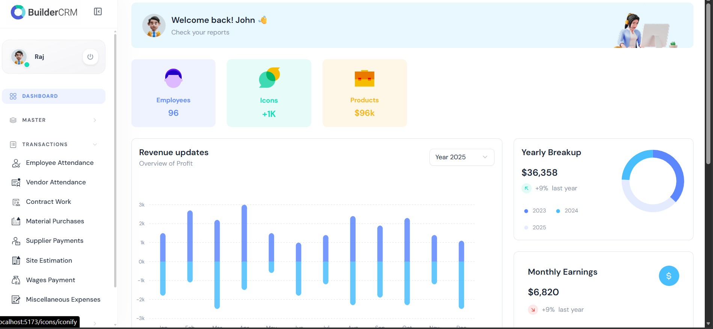
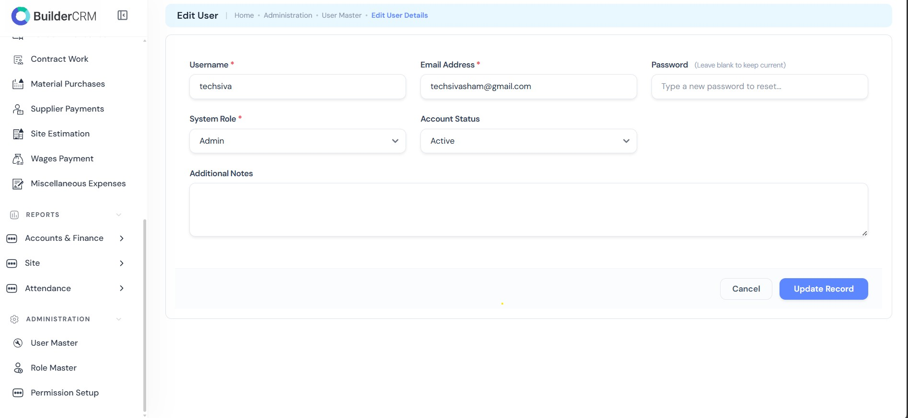
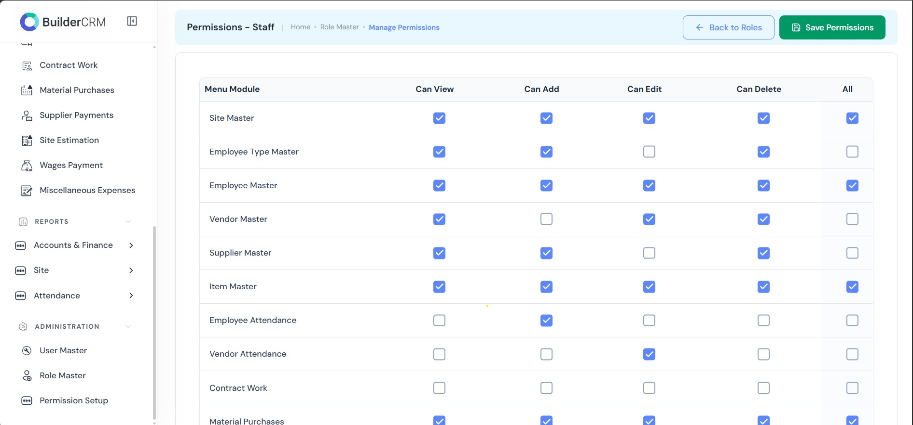
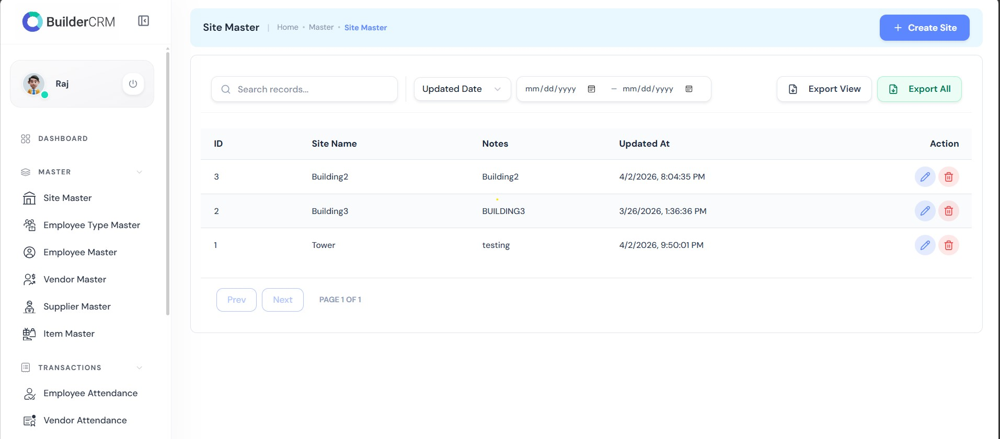
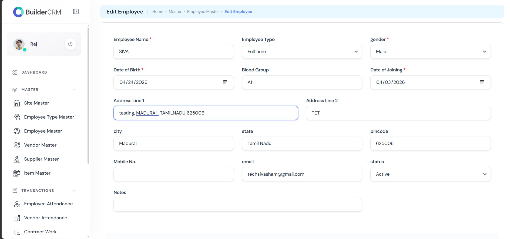
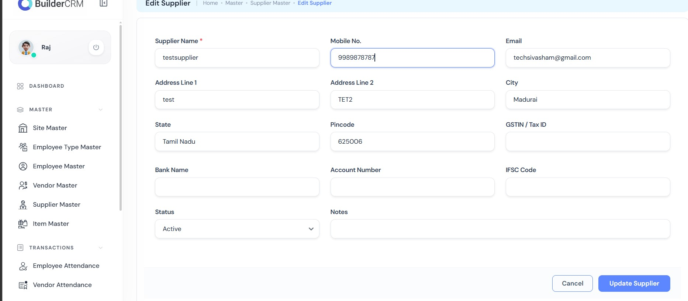
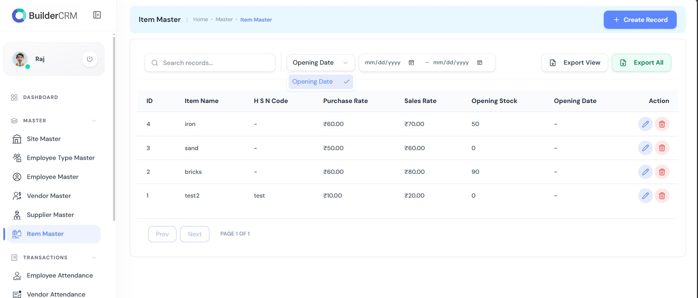
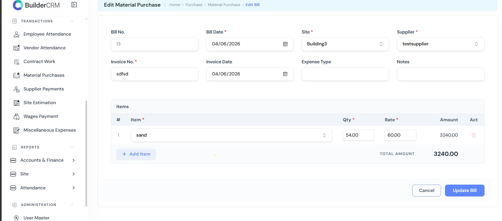

# 🏗️ BuilderCRM (Construction Management System)

A full-stack construction management system designed to handle site operations, workforce management, vendor coordination, and financial transactions efficiently.

---

## 🔧 Tech Stack

* **Frontend:** React.js (Vite)
* **Backend:** Node.js (Express)
* **Database:** MySQL
* **Other:** REST APIs, JWT Authentication

---

## ✨ Key Features

* 🏢 Site Management
* 👷 Employee & Workforce Management
* 🧾 Vendor & Supplier Management
* 📦 Material Purchase Tracking
* 💰 Payment & Expense Management
* 📊 Site Estimation & Cost Tracking
* 📅 Attendance Management (Employee & Vendor)

---

## 📸 Screenshots

| Dashboard | Users |
|:---------:|:-----:|
|  |  |

| Permission Setup | Site Master |
|:----------------:|:-----------:|
|  |  |

| Employee Registration | Supplier Master |
|:--------------------:|:---------------:|
|  |  |

| Item Master | Material Purchase |
|:-----------:|:-----------------:|
|  |  |

---

## 🧩 Core Modules

### 📁 Master Data Management

* Site Master
* Employee Type Master
* Employee Master
* Vendor Master
* Supplier Master
* Item Master

---

### 🔄 Transaction Management

* Employee Attendance
* Vendor Attendance
* Contract Work Tracking
* Material Purchases
* Supplier Payments
* Site Estimation
* Wages Payment
* Miscellaneous Expenses

---

## 🔄 Application Flow

User → React Frontend → Node.js API → MySQL Database → Process → UI Update

---

## 📊 Business Logic Highlights

* Tracks **complete site expenses**
* Manages **labor + vendor coordination**
* Maintains **purchase and payment lifecycle**
* Supports **cost estimation vs actual tracking**

---

## 🧠 Challenges Solved

* Handling multiple relational modules (site, vendor, employee)
* Managing real-time financial transactions
* Designing scalable database structure
* Optimizing queries for reports and tracking

---

## 🚀 Highlights

* Built a **real-world construction ERP-like system**
* Implemented **modular architecture (Master + Transactions)**
* Designed **scalable backend APIs**
* Ensured clean UI for complex workflows

---

🔒 Confidentiality Notice
* The source code for this project is private.
* However, I am happy to discuss the following aspects in detail:

* Database Schema Design & Normalization.
* API Design Patterns and Middleware implementation.
* Frontend State Management strategies for complex CRUD operations.

---

## 📌 Project Status

✅ Completed and actively maintained for learning and enhancement

---

## 👤 About the Developer

**Siva**   |   **Full Stack Developer**  

React.js • Next.js • Node.js • Express.js • MySQL • SQL Server • VB.NET • C#  
Tailwind CSS • Bootstrap • REST API Integration • Web Scraping  

Expertise in building scalable CRM systems, e-commerce analytics, and inventory management software. I focus on writing clean, maintainable code that solves real-world business problems.

🔗 GitHub: https://github.com/techsivasham
