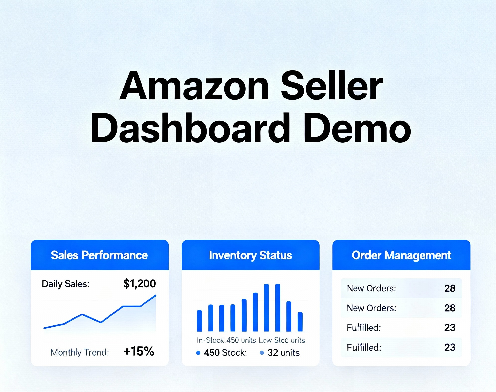
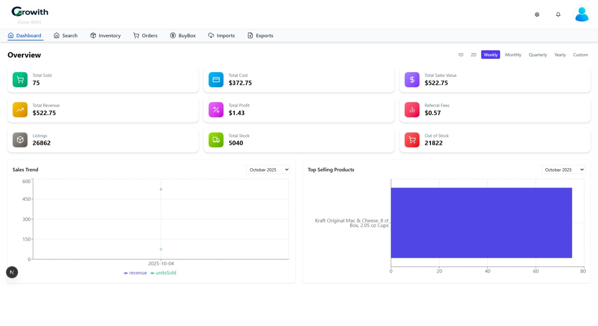
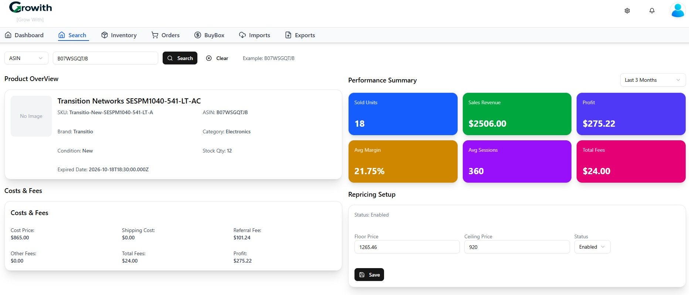
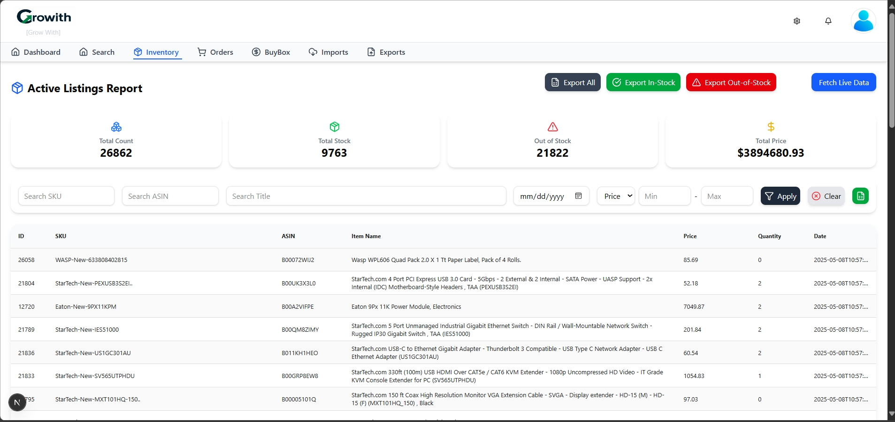
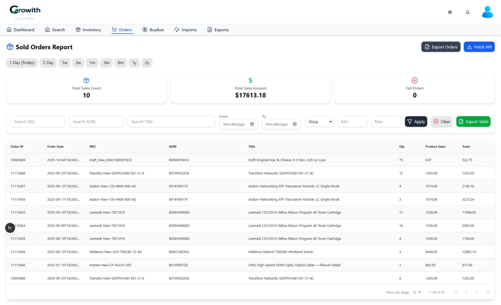
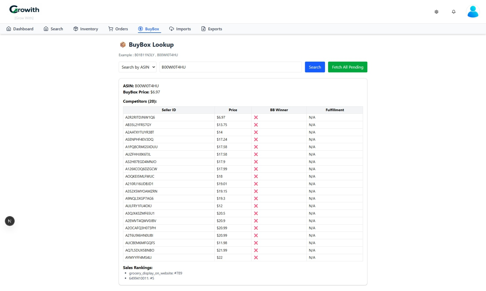

# 📈 GrowWith (eCommerce Analytics Dashboard)

A full-stack analytics platform designed to track, analyze, and optimize eCommerce business performance across multiple marketplaces. Inspired by tools like Feedvisor, this system provides insights into sales, inventory, and profitability.

---

## 🔧 Tech Stack

* **Frontend:** React.js (Vite)
* **Backend:** Node.js (Express)
* **Database:** MySQL
* **Other:** REST APIs, Excel Upload, Data Processing

---

## ✨ Key Features

* 📊 Sales & Performance Dashboard
* 📦 Inventory Tracking
* 💰 Profit & Loss Calculation
* 📁 Excel Upload for Cost Data
* 🔍 Advanced Filters (ASIN, SKU, Date)
* 📉 Product-wise Performance Analysis
* 🔄 Multi-marketplace Data Handling

---

## 📸 Screenshots

| Main Demo | Dashboard |
|:---------:|:---------:|
|  |  |

| Search | Inventory |
|:------:|:---------:|
|  |  |

| Sales Orders | Buy Box |
|:------------:|:-------:|
|  |  |

---

## 🔄 System Flow

Marketplace APIs → Node.js Backend → Data Processing → MySQL → Dashboard UI

---

## 🧩 Core Modules

### 📊 Dashboard & Reports

* Sales overview
* Revenue tracking
* Product performance metrics

---

### 📦 Inventory Management

* Track stock levels
* Monitor active listings
* Identify low-stock items

---

### 💰 Profit Calculation Engine

* Calculates profit per product
* Includes cost, fees, and selling price
* Generates profit/loss reports

---

### 📁 Data Import (Excel)

* Upload cost data via Excel
* Map SKU / ASIN with database
* Automate calculations

---

### 🔌 API Integration Layer

* Fetch data from eCommerce platforms
* Process and normalize large datasets
* Handle API limits and pagination

---

## ⚙️ Database Design (Overview)

* `products` → Product details (ASIN, SKU)
* `orders` → Sales data
* `inventory` → Stock tracking
* `cost_data` → Uploaded cost information
* `reports` → Calculated analytics

---

## 📊 Business Logic Highlights

* Profit = Selling Price − (Cost + Fees + Charges)
* SKU & ASIN-based data mapping
* Aggregated reports by date / product / marketplace

---

## 🧠 Challenges Solved

* Handling large datasets from APIs
* Managing API rate limits
* Data normalization across platforms
* Efficient filtering and reporting
* Excel data integration with database

---

## 🚀 Highlights

* Built a **Feedvisor-like analytics system**
* Implemented **real-time data processing & reporting**
* Designed scalable **API + database architecture**
* Developed advanced **filtering & analytics UI**

---

🔒 Confidentiality Notice
* The source code for this project is private.
* However, I am happy to discuss the following aspects in detail:

* Database Schema Design & Normalization.
* API Design Patterns and Middleware implementation.
* Frontend State Management strategies for complex CRUD operations.

---

## 📌 Project Status

✅ Completed and actively maintained for learning and enhancement

---

## 👤 About the Developer

**Siva**   |   **Full Stack Developer**  

React.js • Next.js • Node.js • Express.js • MySQL • SQL Server • VB.NET • C#  
Tailwind CSS • Bootstrap • REST API Integration • Web Scraping  

Expertise in building scalable CRM systems, e-commerce analytics, and inventory management software. I focus on writing clean, maintainable code that solves real-world business problems.

🔗 GitHub: https://github.com/techsivasham
