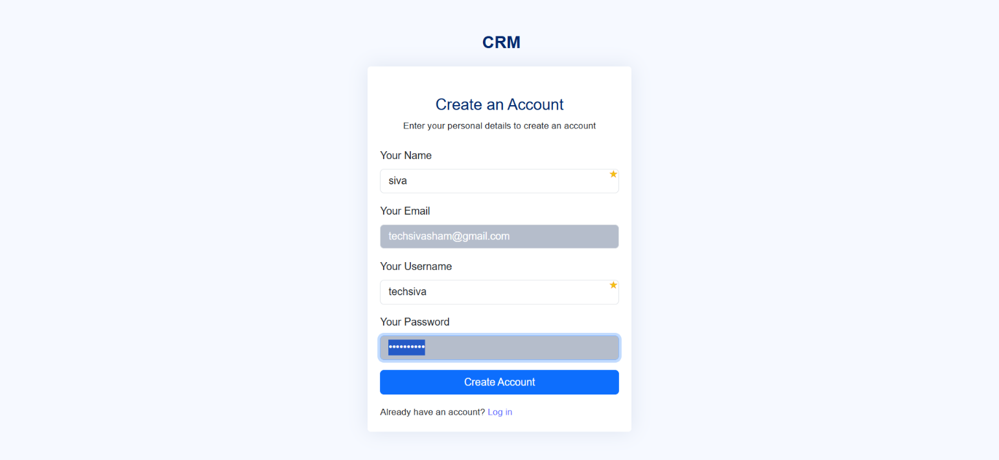
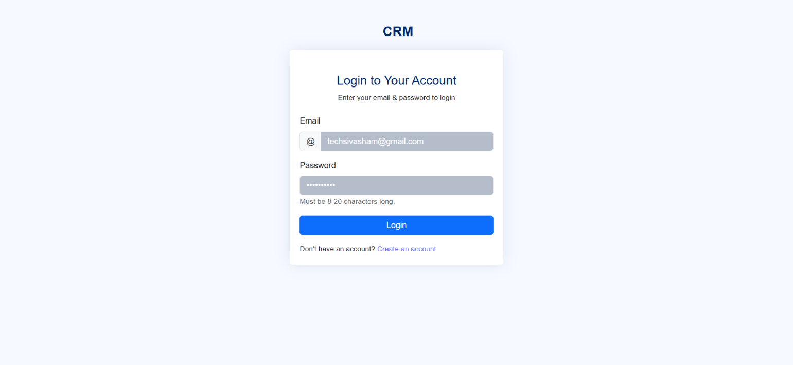
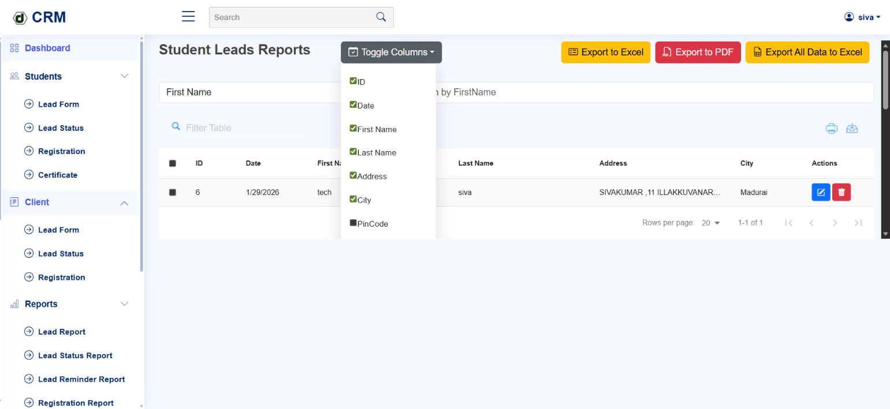
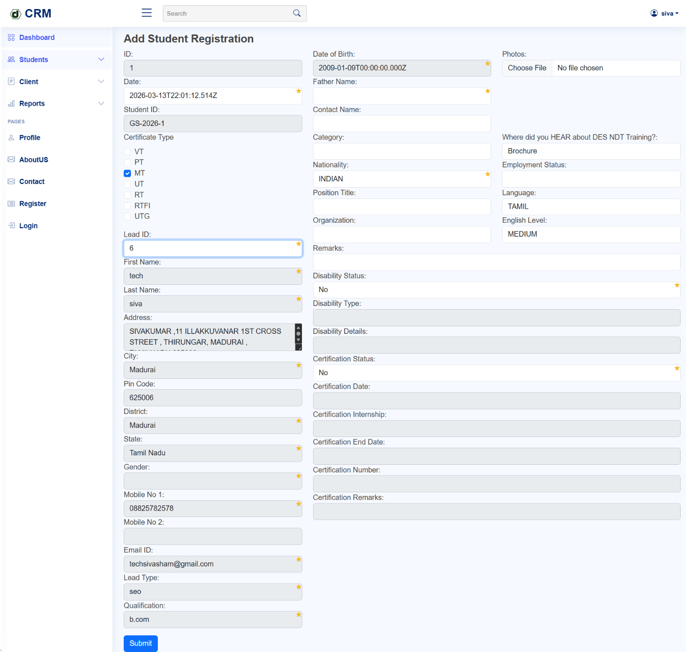
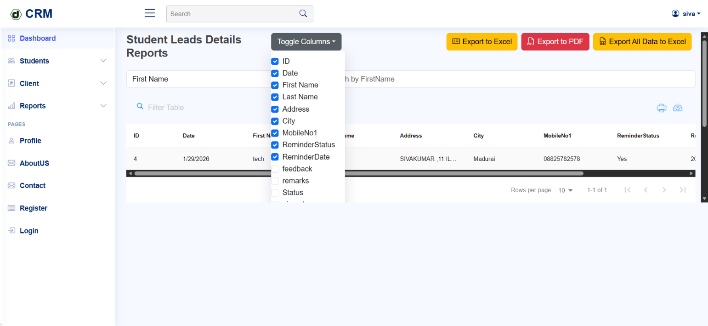
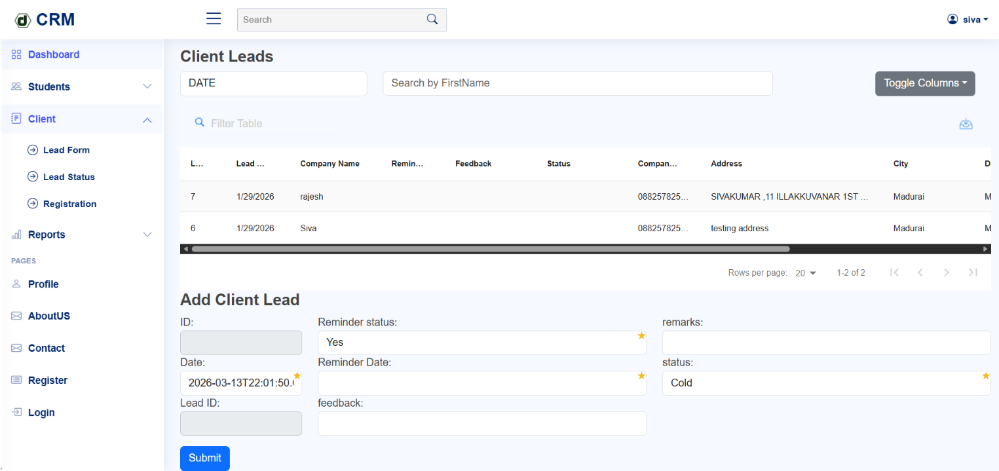

# 🎯 LeadFlow CRM (Student Lead Management System)

A full-stack CRM application designed to manage student leads, track their progress, and generate detailed reports with advanced filtering and export capabilities.

## 🔧 Tech Stack

* **Frontend:** React.js (Vite)
* **Backend:** Node.js (Express)
* **Database:** MySQL
* **Other:** REST APIs, DataTable, Excel/PDF Export

## ✨ Key Features

* 🧑‍🎓 Student Lead Management
* 📝 Lead Form & Status Tracking
* 📋 Registration & Certificate Modules
* 📊 Advanced Reports & Analytics
* 🔍 Multi-field Filtering System
* 📑 Dynamic Column Show/Hide
* 📤 Export to Excel / PDF

---

## 📸 Screenshots

| Register | Login |
|:--------:|:-----:|
|  |  |

| Student Lead Report | Student Registration Form |
|:-------------------:|:-------------------------:|
|  |  |

| Student Lead | Client Lead |
|:------------:|:-----------:|
|  |  |

### 📌 Lead Management

* Add and manage student leads
* Track lead status (new, follow-up, converted)

---

### 🧾 Registration & Certificate

* Convert leads into registered students
* Manage certificate records

---

### 📊 Reporting System

* Lead Report
* Lead Status Report
* Reminder Report
* Registration Report
* and more

### 📑 Dynamic Table Control

* Toggle columns (show/hide fields)
* Pagination & sorting
* Real-time table updates

### 📤 Export Functionality

* Export filtered data to Excel
* Export reports to PDF
* Export full dataset

## 🔄 Application Flow

User → React Frontend → Node.js API → MySQL Database → Process → UI Update

---

## 📊 Business Logic Highlights

* Lead lifecycle tracking (New → Follow-up → Converted)
* Multi-condition filtering system
* Dynamic column visibility control
* Report-based data aggregation

---

## 🧠 Challenges Solved

* Implementing complex multi-filter queries
* Managing dynamic column visibility
* Optimizing large dataset rendering
* Exporting structured data to Excel/PDF

---

## 🚀 Highlights

* Built a **complete student CRM system**
* Implemented **advanced filtering + reporting UI**
* Developed **dynamic table controls (toggle columns)**
* Integrated **Excel & PDF export features**
---

## 🔒 Confidentiality Notice

* The source code for this project is private.

* However, I am happy to discuss the following aspects in detail:

* Database Schema Design & Normalization

* API Design Patterns and Middleware Implementation

* Frontend State Management for complex CRUD operations

---

## 👤 About the Developer

**Siva**   |   **Full Stack Developer**

React.js • Next.js • Node.js • Express.js • MySQL • SQL Server • VB.NET • C#
Tailwind CSS • Bootstrap • REST API Integration • Web Scraping

Expertise in building scalable CRM systems, eCommerce analytics platforms, and inventory management software. Focused on clean, maintainable code and real-world problem solving.

🔗 GitHub: https://github.com/techsivasham

---

## 📌 Project Status

✅ Completed and actively maintained for continuous improvement
